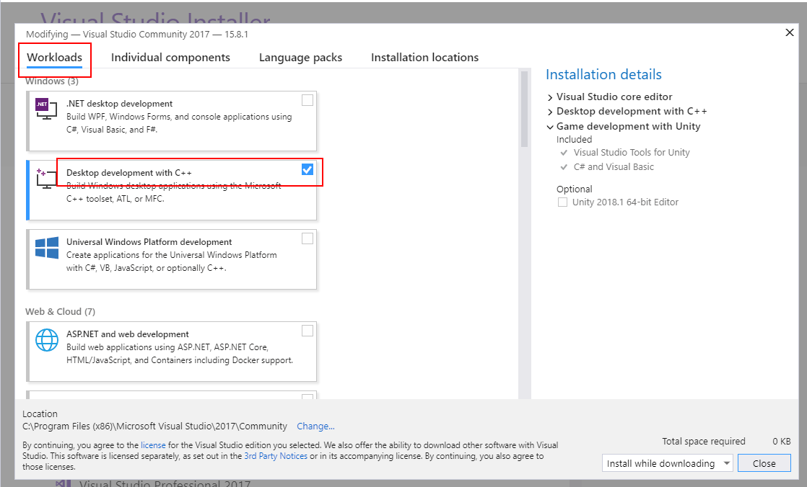
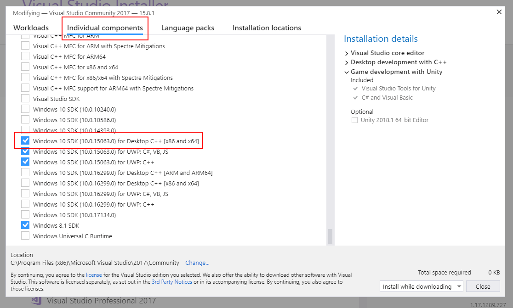
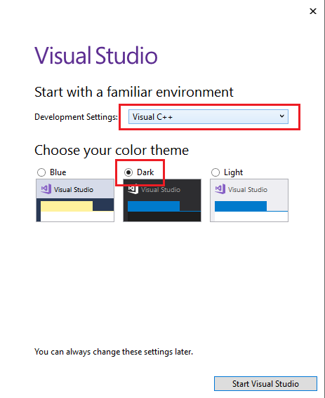

Getting Started
===============

Windows OS
----------

This page will show you everything you need to download and/or install before you can start programming. You'll need a computer with a modern Windows operating system to develop programs with Beta. Beta is not currently supported on Mac or Linux.

Development Environment
-----------------------

Unlike game development tools such as Unreal or Unity, Beta is not an actual program that you run. Rather, it is a `library <https://en.wikipedia.org/wiki/Library_(computing)>`_ of classes and functions that you incorporate into a program you're writing. Typically, this program is written using an `integrated development environment <https://en.wikipedia.org/wiki/Integrated_development_environment>`_, or IDE for short.

The examples and tutorials on this site will assume that you are using Visual Studio, an IDE made by Microsoft that supports development in a variety of languages, C++ included among them.

You can download the installer for Visual Studio Community Edition at the following link:
	
* `Download Visual Studio Community <https://visualstudio.microsoft.com/thank-you-downloading-visual-studio/?sku=Community&rel=15>`_

Note: There are other versions of Visual Studio with more features that you may have access to through your school or through someone who works for Microsoft, but the Community Edition does everything you'll realistically need when working with Beta.

Installing Visual Studio
------------------------

When installing Visual Studio, you'll be presented with a screen that asks you which groups of optional components (or "Workloads") you would like to install. Apart from what's already selected, you should only need to ensure that "Desktop Development with C++," located under "Windows," is checked.

For those of you who, like myself, are paranoid and want to make sure you have exactly what you need to start working, go to the top of the installer and switch over to "Individual Components." Then go down towards the bottom of the list and make sure at least one Windows SDK for Desktop C++ is selected, and that it is for a version of Windows you're actually using (such as 8 or 10). I'm using Windows 10, so I have an SDK for Windows 10 selected in the following image:

	
Running Visual Studio
---------------------

When running Visual Studio for the first time, you'll be presented with a few options on how to set things up. Choose the setting for C++ development.

In addition, if it gives you an option for visual theme, I recommend choosing the Dark Theme.

Beta Libraries and Project Templates
------------------------------------

Once you've verified that Visual Studio is up and running, it's time to download the project template for either the High-Level API or the Low-Level API, depending on which approach you'd like to take. If you've worked with external libraries in Visual Studio before and are confident in being able to set things up yourself, you can also download the libraries by themselves without a project template.

You can find links to download all of these things and more on your course website:
	
* `DigiPen Course Websites <https://canvas.digipen.edu/>`_

Note: Beta depends on a few additional libraries, specifically GLFW for graphics and FMOD Studio API for audio. However, both of these are included in your download of the Beta libraries. You do not need to download these separately.
