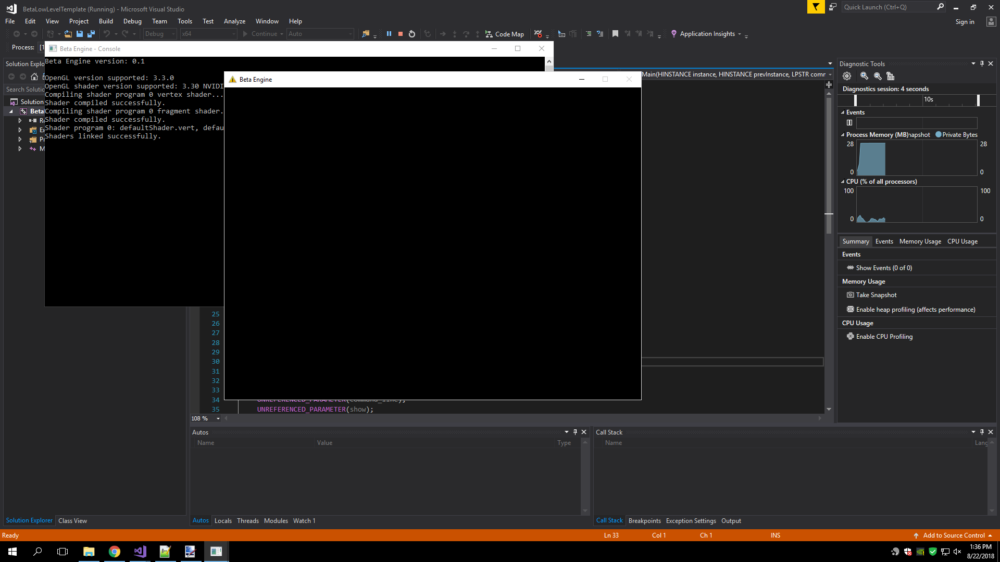
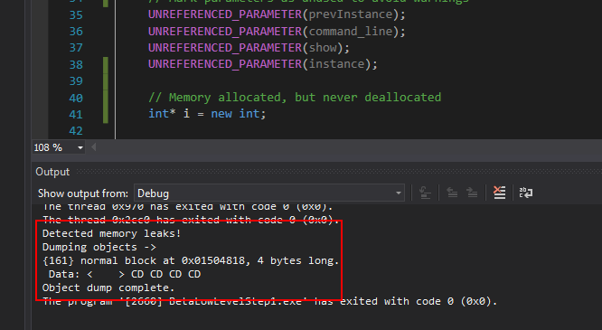
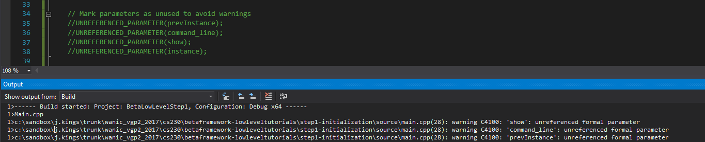
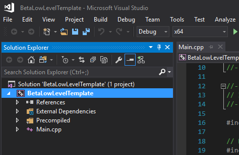
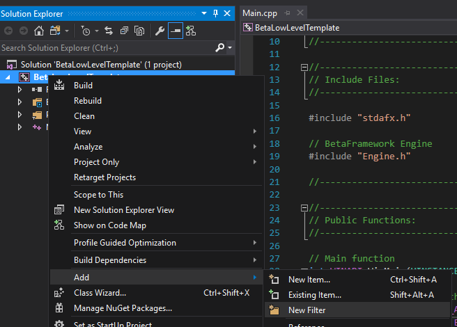
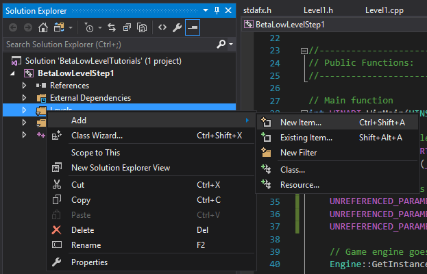
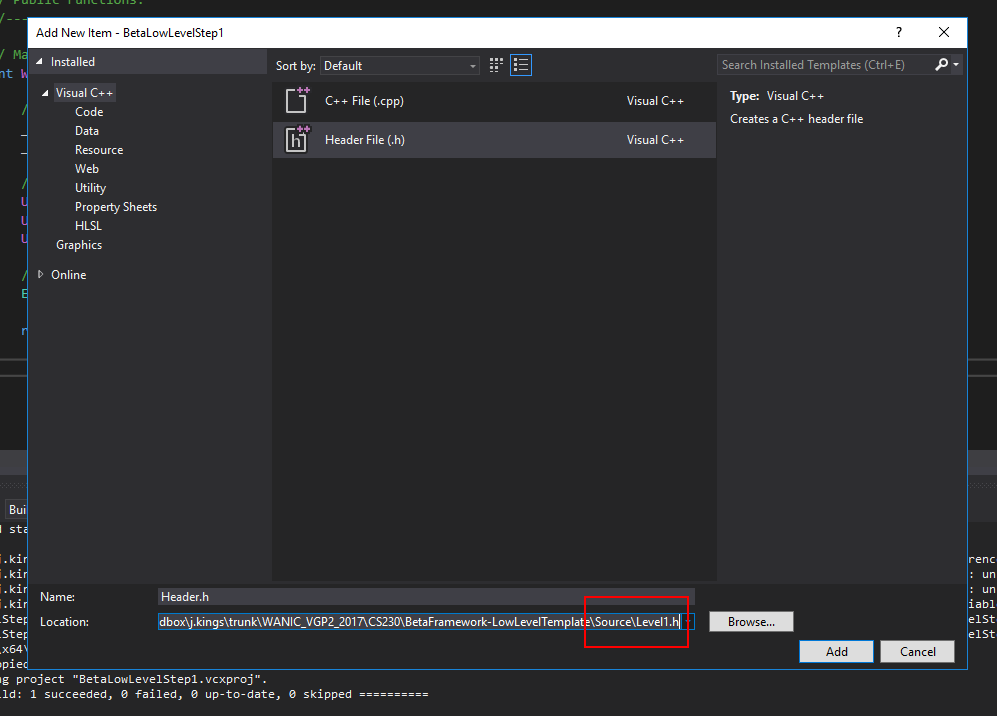
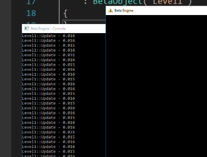
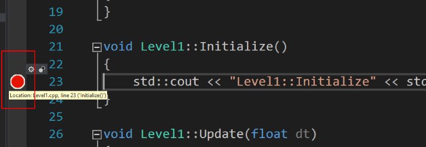
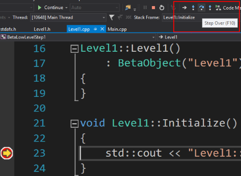

Low-Level API 01 - Starting the Loop
====================================

.. cpp:namespace:: Beta

Overview
--------

This tutorial will take you through creating a basic program using the Low-Level API. By the end of this tutorial you will know how to:

* Initialize the low-level engine class
* Add a custom engine module
* Output to the debug console

If you're not already familiar with C++ or Visual Studio, don't worry! We'll get you acquainted throughout the tutorial.

Step 1 - Setup
--------------

To start things off, download the Low-Level API template project and open it in Visual Studio. Run the program by pressing the F5 key or clicking the green arrow at the top. 

.. note:: If Visual Studio asks you whether you want to build/rebuild the project, always say yes.

What you should see is a black window along with a console window in the background:

.. note:: You can stop a program made using the Beta framework at any time by pressing the escape key.

Step 2 - The Main Function
--------------------------

Now, go ahead and open up the Main.cpp source file in the Solution Explorer. You should see code that looks like this::

	// Main function
	int WINAPI WinMain(HINSTANCE instance, HINSTANCE prevInstance, LPSTR command_line, int show)
	{
		// Mark parameters as unused to avoid warnings
		UNREFERENCED_PARAMETER(instance);
		UNREFERENCED_PARAMETER(prevInstance);
		UNREFERENCED_PARAMETER(command_line);
		UNREFERENCED_PARAMETER(show);
	
		// Enable memory leak checking
		_CrtSetDbgFlag(_CRTDBG_ALLOC_MEM_DF | _CRTDBG_LEAK_CHECK_DF);
		_CrtSetReportMode(_CRT_ERROR, _CRTDBG_MODE_DEBUG);

		// Define startup settings
		using namespace Beta;
		StartupSettings settings;
		settings.windowWidth = 800;
		settings.windowHeight = 600;

		// Game engine goes!
		EngineCore& engine = EngineCore::GetInstance();
		engine.Start(settings);

		return 0;
	}

Let's step through what's happening here. First, the function declaration::

	// Main function
	int WINAPI WinMain(HINSTANCE instance, HINSTANCE prevInstance, LPSTR command_line, int show)

If you've never built a Windows application before, this may look completely indecipherable. We actually don't need to use most of the parameters in this function, so you don't need to concern yourself with them overly much. The one parameter that the Low-Level API does care about is the HINSTANCE, or application instance handle, which is what the operating system uses to find data for the application you've created while it's running. For now, just remember that any Windows application in C/C++ (i.e., something that isn't just a console application) will need this type of main function::

	// Enable memory leak checking
	_CrtSetDbgFlag(_CRTDBG_ALLOC_MEM_DF | _CRTDBG_LEAK_CHECK_DF);
	_CrtSetReportMode(_CRT_ERROR, _CRTDBG_MODE_DEBUG);

These next two lines allow a program built using Microsoft's implementation of C++ to detect memory leaks, i.e., memory you allocated but forgot to deallocate. Game engines do a lot of memory allocation, so this is quite useful. If you forget to deallocate something, you'll see something like this appear in your Visual Studio output console:

This is your first indication that you need to do some digging and squash some memory leaks::

	// Mark parameters as unused to avoid warnings
	UNREFERENCED_PARAMETER(instance);
	UNREFERENCED_PARAMETER(prevInstance);
	UNREFERENCED_PARAMETER(command_line);
	UNREFERENCED_PARAMETER(show);

*UNREFERENCED_PARAMETER* is a simple macro included in one of the framework header files that allows the user to specify when a parameter is intentionally not being used. In general, you don't want any unused parameters. Your compiler will issue a warning if you leave one unused:

However, if you didn't write the function or interface yourself, it's not always possible to avoid those situations. Rather than lowering the warning level of the compiler, you should endeavor to have no warnings whatsoever in your code. Using this macro ensures that you're intentional about unused parameters.

Whew! Now that we've got all that out of the way, we can actually start the application.
	
Step 3 - Initializing the Engine
--------------------------------

Initializing the :cpp:class:`EngineCore` class, which starts your simulation and keeps it running, is actually quite simple::

	StartupSettings settings;
	settings.windowWidth = 800;
	settings.windowHeight = 600;
 	EngineCore::GetInstance().Start(settings);

If you want to change aspects of how the engine starts (such as the display resolution, full-screen, etc.), you can modify the settings variable, as shown above.

What about that weird *GetInstance* function? To explain that, we need to talk a little about types of classes in object-oriented programming. Most classes can support multiple instances of themselves, which makes sense in most cases. For example, in a game, you have a large number of game objects. However, for some classes, it doesn't make sense to have more than one instance of the class. The :cpp:class:`EngineCore` class is one of these classes.

Classes like :cpp:class:`EngineCore` are sometimes made into what's called a singleton. A singleton is a class that prevents you from directly making instances of it. You access the single instance of the class through a `static function <https://www.tutorialspoint.com/cplusplus/cpp_static_members.htm>`_ on the class, in this case called *GetInstance*. Through *GetInstance*, you can access all the public functions of the singleton.

Step 4 - Creating a Level
-------------------------

Now that we know what's already in the program by default, let's add some functionality to it. We'll start by creating a simple level and letting the :cpp:class:`EngineCore` class update it for us. First, let's create a way to organize our levels, since we'll likely have more than one in the future. 

Find the Solution Explorer in Visual Studio and right click on the BetaLowLevelTemplate project:

Then go to Add --> New Filter:

Name this filter Levels. Once the filter is made, you can add files to it. 

.. note:: Filters in your Visual Studio project have no relation to the actual file structure in your project folder. They're just a way for you to organize your project while you have it open in Visual Studio.

To create a level, we'll need to make a new include (.h) file as well as a source (.cpp) file. Right click on the Levels filter and go to Add --> New Item:

Add a header file called Level1.h in the Source subdirectory within your project directory:

Now follow the same procedure to add a C++ file called Level1.cpp. Write the following code in your header file (Level1.h)::

	// Level1.h
	#pragma once
	
	#include "BetaObject.h"
	
	class Level1 : public Beta::BetaObject
	{
	public:
	   Level1();
		
	   void Initialize();
	   void Update(float dt);
	   void Shutdown();
	};

Before we move on to the implementation, let's deconstruct what's going on with that header file::

	#pragma once

This first line serves roughly the same purpose as a header guard in C. It stops us from accidentally including the file multiple times, resulting in a lot of redefinitions of the same variables and classes, and a whole mess of errors::

	#include "BetaObject.h"

	class Level1 : public Beta::BetaObject

Next, we're creating a class called Level1 that inherits from :cpp:class:`BetaObject`, an interface that suggests common functions for objects and systems in a simulation. The :cpp:class:`EngineCore` allows us to add objects that inherit from :cpp:class:`BetaObject` to it, which it will then update. We'll see how to do that in Step 6. 

.. warning:: Make sure to *#include* the header file for the class you're inheriting from, BetaObject.

.. code-block:: cpp

	Level1();

	void Load() override;
	void Initialize() override;
	void Update(float dt) override;
	void Shutdown() override;
	void Unload() override;

The functions of the class include a constructor (the function with the same name as the class), which assists in creating instances of the class, as well as three functions from the :cpp:class:`BetaObject` interface.

This brings us to our first look at a simple game loop.

#. :cpp:func:`BetaObject::Load`: A game loop typically starts with some kind of loading phase. Any assets or resources that will be needed while the game runs are allocated during this stage.
#. :cpp:func:`BetaObject::Initialize`: Following loading is the initialization step. In this stage, game objects are instantiated and variables are set to reasonable default or initial values. 
#. :cpp:func:`BetaObject::Update`: Following initialization, anything that needs to happen every frame, such as polling for input, moving objects, and other game logic, is done continuously until the game ends. 
#. :cpp:func:`BetaObject::Shutdown`: Once the level ends or restarts, objects are destroyed.
#. :cpp:func:`BetaObject::Unload`: When quitting or switching to another level, resources loaded in the Load phase need to be freed up so that memory is available for other levels or other programs.
#. If the game restarts, this process repeats.

There are additional functions that can be added to this sequence, but the majority of engine modules and game objects can be simplified down to the three mentioned above. Any object you give to the :cpp:class:`EngineCore` will have those functions called automatically at the appropriate times.

Step 5 - Writing Text to the Console
------------------------------------

Now let's implement our Level1.cpp file so that it outputs to the debug console at each stage in the game loop::

	// Level1.cpp
	#include "stdafx.h"
	#include "Level1.h"
	
	Level1::Level1()
	   : BetaObject("Level1")
	{
	}
	
	void Level1::Initialize()
	{
	   std::cout << "Level1::Initialize" << std::endl;
	}
	
	void Level1::Update(float dt)
	{
	   std::cout << "Level1::Update - " << dt << std::endl;
	}
	
	void Level1::Shutdown()
	{
	   std::cout << "Level1::Shutdown" << std::endl;
	}

Let's break this down::

	#include "stdafx.h"
	#include "Level1.h"

We have two includes here, both of which are vitally important. The first, stdafx.h, is what's called a precompiled header. It contains include statements for external libraries that will never change that we need to reference, such as operating system files and commonly used headers from the standard library. 

* The upside: The compiler doesn't need to worry about recompiling these, shortening our future compile times. 
* The downside: We have to remember to include the precompiled header in every source (.cpp) file in our project. 

.. warning:: The precompiled header needs to be *first* in the list of includes in any given source file, or things will break in spectacular ways.

The other include is the header file for the class we're now defining functions for. If you're not sure why we need this, I recommend brushing up on your C programming. Once you're feeling comfortable with header files again, resume this tutorial::

	Level1::Level1()
	   : BetaObject("Level1")
	{
	}

This is the constructor for our Level1 class. Its job is to initialize data for the class in a sane and respectable way. We don't have any variables in our Level1 class, but :cpp:class:`BetaObject` requires that all its subclasses provide some kind of name. This is what the ': BetaObject("Level1")' bit is for. We're passing our desired name to our superclass. Don't worry about this too much for now::

	void Level1::Initialize()
	{
	   std::cout << "Level1::Initialize" << std::endl;
	}

This function uses std::cout to output text to the console. std::cout is basically your object-oriented C++ equivalent of C's printf function. We can string together lots of different text and types simply be separating them with <<, as evidenced in the Update function::

	void Level1::Update(float dt)
	{
	   std::cout << "Level1::Update - " << dt << std::endl;
	}

The Update function prints out some text, then the value of dt, which is the amount of time that has passed since the last frame. The bit at the end, std::endl, simply tells the program to proceed to the next line on the console after printing.

The final function, Shutdown, is more of the same.

Step 6 - Adding a Custom Module
-------------------------------

Now we can finally go ahead and add our level to the game. In the future, you'll want to create add systems to manage different levels and objects, but for now we'll stick with just adding a simple level object. In Main.cpp, change the code that starts the engine so it matches the following::

	// Game engine goes!
	EngineCore& engine = EngineCore::GetInstance();
	engine.AddModule<Level1>();
	engine.Start(settings);

Note the new line that makes use of the :cpp:func:`Engine::AddModule` function to add our level to the engine. Now try to run the program again (F5 or the green arrow). If you get any errors, remember to include Level1.h at the top of Main.cpp, then double check the code in your Level1.h and Level1.cpp against the pictures above. If your program works, you should see something like this:

That's a lot of console output! Thankfully, that means the program is running correctly. However, it's hard to tell whether it actually printed the text in the Initialize function. If you want to double check that your program is actually getting there, you can use something called a "breakpoint." Click to the left of the line you want your program to break at like so:

Once your breakpoint is set, a red dot will appear and the program will stop at that line the next time it gets there. Stop the program and start it again and it should pause inside the Initialize function. From here, you can tell the program to move forward one line at a time (using the F10 key or the right arrow button highlighted below) and check the console to see what is being printed out as it goes along:

If you'd like to verify that Shutdown is being called, place a breakpoint in Shutdown or in Main.cpp on the return statement.

Conclusion
----------

Congratulations! You've just created your first program using the Low-Level API. In the next tutorial, we'll take a look at how to go about displaying things in the actual application window.