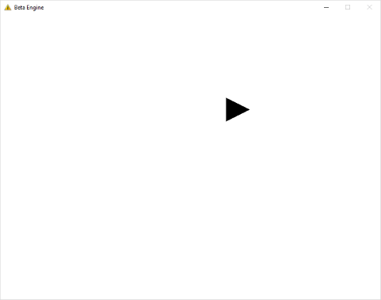
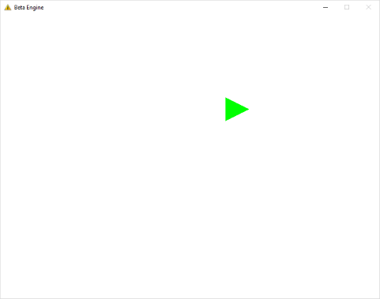

Low-Level API 02 - Creating a Mesh
==================================

.. cpp:namespace:: Beta

Overview
--------

This tutorial will take you through creating a colored object that displays the screen. To do this, we need to create something called a mesh, which is a set of vertices that contain data such as position and color. Our graphics API, in this case OpenGL, will figure out how to turn that collection of vertices into a shape on our screen. By the end of this tutorial, you will know how to:

* Create a mesh using the MeshFactory class
* Draw a mesh in your application display window
* Clean up data used by the mesh when the program shuts down

This tutorial relies on concepts covered in :doc:`Part 1 <01_startingTheLoop>` of the Low-Level API tutorials, so if you haven't read through that, please do so before starting this part of the series.

Step 1 - Setup
--------------

In this tutorial, we'll be continuing where we left off in the previous part, so before we continue, take a moment to verify that your program still works as intended. You should have a program that:

* Adds a level to the Engine class
* Initializes the Engine
* Prints text to the console during the level's Initialize, Update, and Shutdown functions

Ready to go? If so, then continue with the next step.

Step 2 - Level Creation
-----------------------

In the interest of more easily tracking our progress through the tutorials, we'll be creating another level class for this tutorial. First, add a header (.h) file called **Level2.h** to your project under the *Levels* filter::

	// Level2.h
	#pragma once
	
	// Includes
	#include "BetaObject.h"
	
	// Forward declaration
	namespace Beta
	{
	   class Mesh;
	}
	
	// Class definition
	class Level2 : public Beta::BetaObject
	{
	public:
	   Level2();
	   
	   // Game loop functions
	   void Initialize();
	   void Update(float dt);
	   void Shutdown();
	   
	private:
	   Beta::Mesh* mesh;
	};

As with the previous level, our Level2 class inherits from :cpp:class:`BetaObject` so that we can easily test it using the Engine class. We have our same three functions, *Initialize, Update, and Shutdown,* each of which will now have a job to do besides printing debug text. There are a couple things here we haven't seen before, however::

	private:
	   Beta::Mesh* mesh;

This one is easy to explain. It's a variable that will eventually point to the vertex data for our mesh. We don't know yet how many vertices our mesh will have or when we'll need it, so it is declared as a pointer rather than a regular variable. This also allows us to choose when it is destroyed, which is good since that lets us delay expensive operations like memory management until it won't cause a noticeable slowdown::

	// Forward declaration
	namespace Beta
	{
	   class Mesh;
	}

This bit of code is used in place of actually including the Mesh class. We can only do this if the variable(s) we're creating are pointers or references, since in that case the class doesn't have to know how to create that type right away. But why do this? Why not just include Mesh.h and be done with it?

The answer is this: Very few classes that include Level2.h will need to know how a Mesh works -- it's a private piece of data in the class -- but if we included Mesh.h in Level2.h, every file that includes Level2.h now also includes Mesh.h. This is completely unnecessary.

Instead, we create this forward declaration and only include the Mesh.h file in our source (.cpp) files that will actually be calling mesh functions. Expect to see forward declarations frequently in future tutorials.

Now, let's add a source (.cpp) file called **Level2.cpp** to your project under the *Levels* filter::

	// Level2.cpp
	#include "stdafx.h"
	#include "Level2.h"
	
	using namespace Beta;
	
	Level2::Level2()
	   : BetaObject("Level2"), mesh(nullptr)
	{
	}
	
	void Level2::Initialize()
	{
	   std::cout << "Level2::Initialize" << std::endl;
	   
	   // TO-DO: Create the mesh
	}
	
	void Level2::Update(float dt)
	{
	   UNREFERENCED_PARAMETER(dt);
	   
	   // TO-DO: Draw the mesh
	}
	
	void Level2::Shutdown()
	{
	   std::cout << "Level2::Shutdown" << std::endl;
	
	   // TO-DO: Delete the mesh
	}

For our actual source code, what we have so far is essentially identical to our previous level. We'll change that soon, but for now, just test to make sure Level2 works in its current state. To test Level2 right now, you'll need to modify your Main.cpp to add Level2 to the Engine instead of Level1.

.. note:: You could technically add both level objects to the engine, but the engine will just run them both every frame, which is not what levels usually do. We'll need to build something more complex to manage level switching.

Note the comments that indicate what we're going to want to do in each function. Let's briefly review our game loop functions again:

1. :cpp:func:`BetaObject::Initialize`: Any resources that will be needed while the game runs are allocated during this stage, and variables are set to reasonable values. 
2. :cpp:func:`BetaObject::Update` Anything that needs to happen every frame is done continuously until the game ends. 
3. :cpp:func:`BetaObject::Shutdown` Resources that were allocated during initialization are freed up so that they can be used by other programs.

We want to create a mesh in Initialize since we only need to do that once, then draw it every frame in Update, then delete it once in Shutdown.

Step 3 - Creating the Mesh
--------------------------

To start off, we'll be creating a simple mesh with one triangle. Meshes are typically composed of many triangles, but for a 2D game, we won't usually have to make anything with more than just a few. Add the following code to your **Initialize** function in *Level2.cpp*::

	void Level2::Initialize()
	{
	   std::cout << "Level2::Initialize" << std::endl;
	   
	   // Obtain mesh factory module
	   MeshFactory& meshFactory = *EngineGetModule(MeshFactory);
	   
		 // Create the mesh
		 
	   // Add a green triangle
	   meshFactory.AddTriangle(Vector2D(-0.5f, 0.5f),
	      Vector2D(-0.5f, -0.5f), Vector2D(0.5f, 0.0f), Colors::Green);
	   
	   // End mesh creation
	   mesh = meshFactory.EndCreate();
	}

:cpp:class:`MeshFactory` is a module in the Low-Level API class that is used to construct meshes.

.. code-block:: cpp

	// Add a green triangle
	meshFactory.AddTriangle(Vector2D(-0.5f, 0.5f), 
	   Vector2D(-0.5f, -0.5f), Vector2D(0.5f, 0.0f), Colors::Green);

First, we add our triangle. There are a couple different ways to go about this. In the method we're using above, we specify positions for each vertex. These positions are given as instances of Vector2D, which is the class we'll be using for 2D points and vectors. Each Vector2D requires an X coordinate and a Y coordinate. We then specify a single color which will be applied to all three vertices. You can choose a premade color or make your own by creating a Color object. We'll explore this later. For meshes that use textures, having one color applied to all vertices is typically sufficient::

	// End mesh creation
	mesh = meshFactory.EndCreate();

Finally, we tell the mesh factory that we are done creating the mesh. It does some negotiation with OpenGL, then provides us with a pointer to the completed mesh, which we can store in the variable we declared in the Level2 class definition.

Step 4 - Deleting the Mesh
--------------------------

In Step 3, we called code that dynamically allocated memory for our mesh. Before we even begin writing code that uses this memory, we should decide where to deallocate it. For a game loop, there's an easy rule for handling most of these decisions, which is this:

.. hint:: Anything allocated in Initialize or Update should be deallocated in Shutdown.

Add the following code to your **Shutdown** function in *Level2.cpp*::

	// Delete the mesh
	delete mesh;

Using the *delete* keyword followed by the name of a dynamically allocated variable ensures that the class's *destructor* is called. In its destructor, the Mesh class will take care of releasing any resources it held onto.

Now is a good time to test your program again. When you let the program run its course and stop the application by pressing escape, you shouldn't see any mention of memory leaks detected in your Visual Studio console.

Step 5 - Drawing the Mesh
-------------------------

Now that we know our memory is being deallocated, we can draw the mesh. This is done by calling its Draw function. Add the following code to your **Update** function in *Level2.cpp*::

	// Draw the mesh
	mesh->Draw();

Simple, right? Let's see what happens when we run the program now...

.. image:: 02_meshCreation-06.png

Whoops! There's nothing there, so we've obviously done something wrong. What's going on, though? Try adding to the following code to your **Update** function before the call to the mesh's Draw function to help debug our problem::

	// Set the background color to white
	GraphicsEngine& graphics = *EngineGetModule(GraphicsEngine);
	graphics.SetBackgroundColor(Colors::White);
	
	// Set the position and scale to use when drawing
	graphics.SetTransform(Vector2D(1.0f, 1.0f), Vector2D(0.5f, 0.5f));

The first line is pretty self-explanatory. The second line sets the position and scale that the GraphicsEngine class uses when drawing the mesh. We could have just changed the positions of the vertices, but eventually we'll be relying on the object to specify a size rather than the mesh itself, so it's best to keep the mesh small.

.. hint:: A good general rule is to keep the vertices for your meshes within a 1 by 1 square centered at 0, 0. Other classes will then tell GraphicsEngine what scale to use when drawing.

The goal of these two lines is the following:

1. Make sure graphics know where to draw the object and how large it should be in case it's too small (or too big) to see.
2. Change the background color in case what we're drawing is black instead of the color we wanted.

Running the program again gives us the following result:

The triangle is now being drawn, but still not the right color. One possibility is that GraphicsEngine is trying to look for a texture that isn't there. We don't actually want to use a texture right now, so we can add the following code before our call to the mesh's Draw function::

	// Use the default (white) texture
	graphics.GetDefaultTexture().Use();

We're requesting access to the default texture, a 1x1 white square, and making sure graphics uses that when drawing sprites. Does this fix the issue?

It does! We now know the following:

* Our mesh needs to big enough to be seen on the screen. The preferred way to accomplish this is through the SetTransform function on the GraphicsEngine class.
* We can also use SetTransform to change the position that a mesh is drawn at on the screen.
* If we're not using our own texture, we need to specify that by telling the GraphicsEngine to use the default texture.

Step 6 - On Your Own
--------------------

Try creating meshes more than one triangle. See if you can make some of the following shapes:

* Rectangle
* Parallelogram
* Pentagon
* Hexagon

Also try these experiments:

* What happens if you draw a mesh more than once in a single frame?
* What happens if you change the drawing position before drawing the mesh again?
* Can you use SetTransform to rotate a mesh?
* There's another version of the AddTriangle function that accepts several vertices, each with their own color. If some vertices in a mesh have different colors, what happens?

Conclusion
----------

Congratulations! You now know how to get things to appear on the screen. Next we'll be taking a look at how to apply textures to meshes.