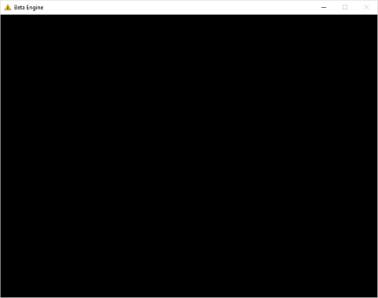
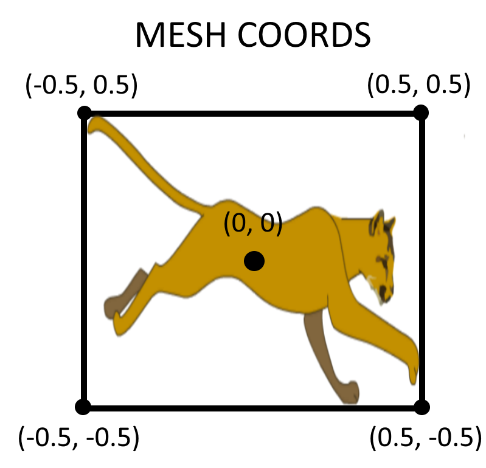
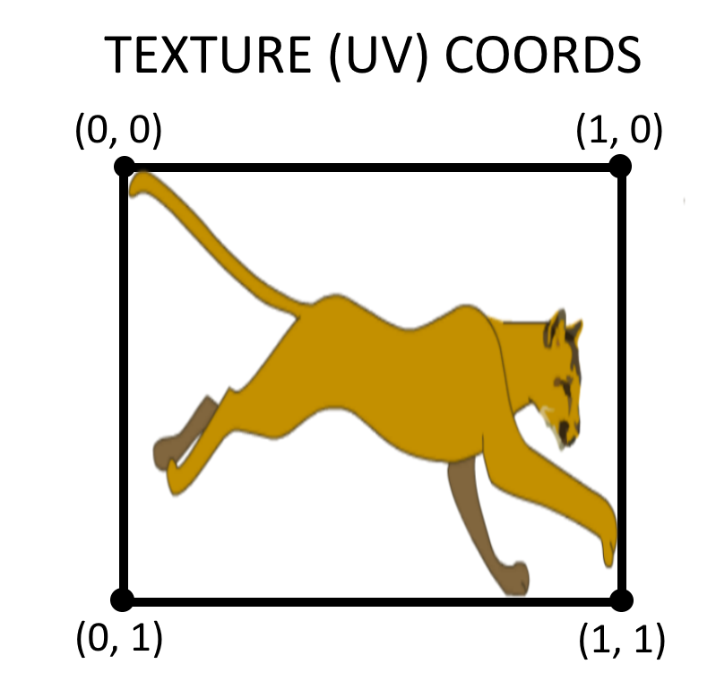
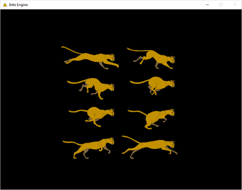
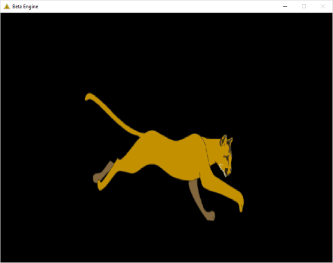

Low-Level API 03 - Simple Textures
==================================

.. cpp:namespace:: Beta

Overview
--------

This tutorial will take you through loading an image from a file and displaying it on the screen. To do this, we need a mesh, which we've already dealt with in the previous tutorial, as well as a texture, which is our internal representation of the image in our program. By the end of this tutorial, you will know how to:

* Create a texture from an image file using the Texture class
* Create a mesh with proper texture coordinates
* Use texture coordinates to display a single frame from a sprite sheet

This tutorial relies on concepts covered in :doc:`Part 2 <02_meshCreation>` of the Low-Level API tutorials, so if you haven't read through that, please do so before starting this part of the series.

Step 1 - Setup
--------------

In this tutorial, we'll be continuing where we left off in the previous part, so before we continue, take a moment to verify that your program still works as intended. You should have a program that:

* Adds a level to the Engine class
* Initializes the Engine
* Creates a mesh in the level's Initialize function
* Displays a green triangle on the screen in the level's Update function
* Destroys the mesh in the level's Shutdown function

Ready to go? If so, then continue with the next step.

Step 2 - Level Creation
------------------------

In the interest of more easily tracking our progress through the tutorials, we'll be creating another level class for this tutorial. First, add a header (.h) file called **Level3.h** to your project under the *Levels* filter::

	// Level3.h
	#pragma once
	
	// Inheritance
	#include "BetaObject.h"
	
	// Forward declarations
	namespace Beta
	{
	   class Mesh;
	   class Texture;
	}
	
	// Class definition
	class Level3 : public Beta::BetaObject
	{
	public:
	   Level3();
	   
	   // Game loop functions
	   void Initialize();
	   void Update(float dt);
	   void Shutdown();
	   
	private:
	   Beta::Mesh* mesh;
	   Beta::Texture* texture;
	};

This is nearly identical to Level2, with two notable exceptions:

#. We've declared a Texture pointer in our private variables, which will later point to our texture data.
#. We've created a forward declaration for Texture so that nothing that includes Level3 will accidentally include Texture.h.

Now, let's add a source (.cpp) file called Level3.cpp to your project under the Levels filter. For this step, feel free to copy what you currently have in Level2.cpp but be *extra careful* to find and replace all instances of "Level2" with "Level3" or your program will be confusing at best and horribly broken at worst.

Before moving on, test to make sure Level3 works in its current state by modifying your **Main.cpp** to add *Level3* to the Engine instead of Level2.

Step 3 - Loading a Texture
--------------------------

Loading a texture in the Low-Level API is quite simple. All we need to do is call the static *CreateTextureFromFile* function on the Texture class and pass it the appropriate filename. Add this code to your **Initialize** function in your *Level3.cpp* file::

	// Load the cat texture
	texture = Texture::CreateTextureFromFile("runningcat.png");

.. warning:: By default, the Low-Level API will expect textures to be in the Textures subfolder of the Assets folder in your Visual Studio project directory (or the executeable directory if you send your game to other people). It is recommended that you conform to this file structure to keep your files organized.

.. note:: The texture we're using is an image of a large cat running. It is included with the Low-Level API Visual Studio project template, so unless you created your project from scratch, it should already be in the correct folder in your project.

Before we go any further, let's be sure to deallocate our texture in the **Shutdown** function::

	// Delete the cat texture
	delete texture;

Just like deallocating a mesh, getting rid of a texture is similarly quite simple. Using delete on the texture calls the Texture destructor which takes care of the rest. Now all we need to do is set the texture in the **Update** function before we draw::

	// Use the cat texture
	texture->Use();

After correctly loading our texture and setting it, running the program gives us the following result:

What's going on now? The first problem is that we're trying to draw a rectangular texture onto a single triangle, which probably wouldn't have worked well in the first place. The reason we're not seeing anything yet, though, is due to the fact that we never specified texture coordinates for our mesh.

Step 4 - Texture Coordinates
----------------------------

Texture coordinates (or UV coordinates) are what we use to decide how an image maps onto the vertices of our mesh. Unlike our meshes, which typically range from -0.5 to 0.5 on both the x-axis and y-axis, texture coordinates always range from 0 to 1, no matter the size of the image. Here are a couple pictures that demonstrate the difference between mesh and texture coordinates. By comparing these pictures, you can see how the texture coordinates map to the mesh coordinates.

|pic1| |pic2|

We can't specify texture coordinates using the AddTriangle function that we used before. Instead, we need to use an alternate version of the function that accepts instances of the Vertex class instead of the Vector2D class. We also need to create two triangles which, together, will form a rectangle. Your code for all of that should look something like this::

	// Create four vertices - two will be shared by our two triangles
	// Vertices take two parameters - position and texture coordinates
	Vertex topLeft = Vertex(Vector2D(-0.5f, 0.5f), Vector2D(0.0f, 0.0f));
	Vertex topRight = Vertex(Vector2D(0.5f, 0.5f), Vector2D(1.0f, 0.0f));
	Vertex bottomRight = Vertex(Vector2D(0.5f, -0.5f), Vector2D(1.0f, 1.0f));
	Vertex bottomLeft = Vertex(Vector2D(-0.5f, -0.5f), Vector2D(0.0f, 1.0f));
	
	// Create a mesh from two triangles. These triangles share 
	// the top left and bottom right vertices.
	MeshFactory& meshFactory = *EngineGetModule(MeshFactory);
	meshFactory.AddTriangle(topLeft, topRight, bottomRight);
	meshFactory.AddTriangle(topLeft, bottomLeft, bottomRight);
	mesh = meshFactory.EndCreate();

If we now try to draw the mesh with the texture applied, we get (almost) the correct results:

Step 5 - Texture Coordinate Offsets
-----------------------------------

The texture we're using is intended to be used as an animation, meaning we actually only want to display one frame instead of the whole image. We can do this by shrinking our texture coordinates so they map to only the first frame. Since texture coordinates only range from 0 to 1, we can easily determine what our texture coordinates should be:

#. Divide all of your x-coordinates by the number of columns in the animation.
#. Divide all of your y-coordinates by the number of rows in the animation.

With those modifications, the code for creating the mesh (in Initialize) should look like this::

	// Create four vertices - two will be shared by our two triangles
	// Vertices take two parameters - position and texture coordinates
	unsigned columns = 2, rows = 4;
	Vertex topLeft = Vertex(Vector2D(-0.5f, 0.5f), Vector2D(0.0f, 0.0f));
	Vertex topRight = Vertex(Vector2D(0.5f, 0.5f), Vector2D(1.0f / columns, 0.0f));
	Vertex bottomRight = Vertex(Vector2D(0.5f, -0.5f), Vector2D(1.0f / columns, 1.0f / rows));
	Vertex bottomLeft = Vertex(Vector2D(-0.5f, -0.5f), Vector2D(0.0f, 1.0f / rows));

Now we should get the correct result - a single frame of the animation:

Step 6 - On Your Own
--------------------

On your own, try finding some other textures and correctly mapping them to a mesh. Think about how you could make this process easier. What sorts of functions, structures, or classes could you create to help you? What might their interfaces look like?

Conclusion
----------

Congratulations! You now know how to load textures and map them to meshes. In the next tutorial, we'll go over how to change frames in an animation.