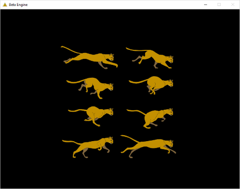

Low-Level API 04 - Animations
=============================

.. cpp:namespace:: Beta

Overview
--------

This tutorial will take you through writing the code to correctly animate a sprite. To do this, we need a mesh and a texture containing multiple frames, which we've already dealt with in previous tutorials. We also need a way to use the number of rows and columns in the animation to correctly alter texture coordinates and display a specific frame of the animation. By the end of this tutorial, you will know how to:

* Use texture coordinate (UV) offsets to display a specific frame from a sprite sheet
* Change UV offsets over time to switch between multiple frames of an animation

This tutorial relies on concepts covered in :doc:`Part 3 <03_simpleTextures>` of the Low-Level API tutorials, so if you haven't read through that, please do so before starting this part of the series.

Step 1 - Setup
--------------

In this tutorial, we'll be continuing where we left off in the previous part, so before we continue, take a moment to verify that your program still works as intended. You should have a program that:

* Adds a level to the Engine class
* Initializes the Engine
* Creates a mesh in the level's Initialize function
* Loads a texture from a file in the level's Initialize function
* Displays a texture in the level's Update function
* Unloads the texture in the level's Shutdown function
* Destroys the mesh in the level's Shutdown function

Ready to go? If so, then continue with the next step.

Step 2 - Level Setup
--------------------

In this tutorial, rather than create a new level, we'll be editing the one we used in the previous tutorial, **Level3.h/.cpp**. If you like, you can make a new level and copy everything from *Level3* into it, but this is not required. The instructions for this tutorial will assume you are working out of *Level3*.

To facilitate our work with animations, a few additional variables will need to be added to our level. Specifically, we'll need to be able to track the *current frame* of our animation, the *number of rows* in the sprite sheet, the *number of columns* in the sprite sheet, and a *timer* so that we can better control the timing of our animation. 

Add the following variables to your **Level3.h** file in the *private* section::

	// Animation data
	float timer;
	unsigned currentFrame;
	unsigned rows;
	unsigned columns;
	unsigned totalFrames;
	
Next, you'll want to initialize these values in the constructor (**Level3::Level3()**) of *Level3.cpp*. When initializing member variables, it is recommended that you use the *member initializer list* (MIL for short) rather than assigning the values within the body of the constructor::

	Level3::Level3()
	   : BetaObject("Level3"), mesh(nullptr), texture(nullptr),
	   timer(0.0f), currentFrame(0), rows(4), columns(2), totalFrames(rows * columns)
	{
	}
	
The numbers of rows and columns are not random. You can easily tell how many rows and columns are in a sprite sheet by looking at the texture file and counting them. The image we are using looks like this:

Hence, 4 rows and 2 columns.

.. note:: If your implementation doesn't look quite like this (smaller, for example), make sure your call to *SetTransform* in the **Update** function of *Level3.cpp* is using (0,0) for the position and something like (3,3) or so for the scale.

Step 3 - Changing Frames
------------------------

Remember the problems we ran into during the previous tutorial? When we first drew the cat sprite, it displayed all of the frames in the animation instead of just a single one. To fix this, we altered our mesh so that the vertices of the mesh mapped to a smaller portion of the texture. The mesh creation code in the **Initialize** function of *Level3.cpp* should look like this::

	// Create four vertices - two will be shared by our two triangles
	// Vertices take two parameters - position and texture coordinates
	Vertex topLeft = Vertex(Vector2D(-0.5f, 0.5f), Vector2D(0.0f, 0.0f));
	Vertex topRight = Vertex(Vector2D(0.5f, 0.5f), Vector2D(1.0f / columns, 0.0f));
	Vertex bottomRight = Vertex(Vector2D(0.5f, -0.5f), Vector2D(1.0f / columns, 1.0f / rows));
	Vertex bottomLeft = Vertex(Vector2D(-0.5f, -0.5f), Vector2D(0.0f, 1.0f / rows));
	
If you still have any local variables for columns and/or rows, you may remove them, as they are now part of the class declaration. We are making them class variables so that they can be used in the *Update* function as well.

Let's start with changing the *Update* function in *Level3.cpp* so that it uses a different frame of the animation. Find the code that uses the texture in **Update** and change it so it matches the following::

	// Use the cat texture
	unsigned currentColumn = 1;
	unsigned currentRow = 2;
	texture->Use(Vector2D((float)currentColumn / columns, (float)currentRow / rows));
	
The :cpp:func:`Texture::Use` function has an optional parameter that allows the user to specify a "UV offset." This offset is added to the base texture coordinates that are used when the sprite is drawn, causing the portion of the texture that is drawn to shift proportionately. Since UV coordinates are between 0 and 1, we need to specify the correct value between 0 and 1 for both U and V to get the specific frame we want. We do this by dividing the desired column or row index by the number of columns or rows.

Using values of 1 and 2 for our current column and row, respectively, will display the *second* frame of the *third* row:

You can verify this is the correct row by looking at the sprite sheet and finding the corresponding row and column.

Step 4 - Calculating the Next Frame
-----------------------------------

Keeping track of the current row and column is one way to keep our animation code organized. To advance to the next frame, we could first increase the *current column*. Then, when that value is greater than or equal to the *number of columns*, we reset the column to 0 and advance the *current row*. When the row value is greater than or equal to the *number of rows*, we reset the row to 0. The code would look something like this::

	++currentColumn;
	
	if(currentColumn >= columns)
	{
	  currentColumn = 0;
	  ++currentRow;
	  
	  if(currentRow >= rows)
	  {
		currentRow = 0;
	  }
	}

We can accomplish the same thing in fewer lines of code if we're clever, though. If we want something to increase, but reset back to 0 once it reaches a certain value, the *modulus* operator, which gives us the remainder from division, can help us immensely. Here's the previous code, but simplified using modulus::

	currentColumn = (currentColumn + 1) % columns;

	if (currentColumn >= columns)
	{
	   currentRow = (currentRow + 1) % rows;
	}
	
This almost works. The only issue is that because the *currentColumn* is now reset to 0 before the if statement, it will never change the row. We can fix this by reordering our statements and changing the comparison::
	
	if (currentColumn + 1 >= columns)
	{
	   currentRow = (currentRow + 1) % rows;
	}
	
	currentColumn = (currentColumn + 1) % columns;
	
From here, all that's left is to compute the U and V offset using the current row and column indices, which we already demonstrated earlier in this tutorial::

	float uOffset = (float)currentColumn / columns;
	float vOffset =	(float)currentRow / rows;

This code will work just fine. However, in many sprite sheets, a single animation can span several rows. Thus, it would be better if we could simply track the current frame in the animation and calculate both the U and V offset from that single number. Thankfully, with the work we've already done, this is a relatively simple change. We can once again use the *modulus* operator in a clever way to get the current row and column based on the current frame::

	currentFrame = (currentFrame + 1) % totalFrames;
	unsigned currentColumn = currentFrame % columns;
	unsigned currentRow = currentFrame / columns;
	
The *remainder* of division between the current frame and number of columns will give us a number from 0 to the number of columns minus 1. The *division* of the current frame by the number of columns will give us a number from 0 to the number of rows minus 1 (assuming we've calculated our total number of frames correctly). Now, we can safely advance through our animation using only a single counter. The code in your **Update** function in *Level3.cpp* should look something like this::

	UNREFERENCED_PARAMETER(dt);

	// Set the position and scale to use when drawing
	GraphicsEngine* graphics = EngineGetModule(GraphicsEngine);
	graphics->SetTransform(Vector2D(0.0f, 0.0f), Vector2D(4.0f, 4.0f));

	// Advance current frame
	currentFrame = (currentFrame + 1) % totalFrames;
	unsigned currentColumn = currentFrame % columns;
	unsigned currentRow = currentFrame / columns;

	// Use the animated texture with correct UV offset
	texture->Use(Vector2D((float)currentColumn / columns, (float)currentRow / rows));

	// Draw mesh
	mesh->Draw();
	
Compiling and running this program will indeed advance correctly, but at a speed of 1 animation frame per every 1 update tick, which is far too fast to be useful! Our next task is to find a way to control the speed of our animation.

Step 5 - Frames Per Second
--------------------------

Now that our animation is advancing correctly, we can take the steps necessary to slow it down. This is where the *timer* variable we declared in the class will come in handy.

Timers are a fairly common occurrence in interactive programs. The basic form of timing code usually looks something like this::

	// This function is called every frame
	// Params:
	//   dt = The change in time since the last update (in seconds).
	void Update(float dt)
	{
	   timer += dt;
	
	   if(timer > threshold)
	   {
	      // Do something (insert code here)
		
	      // Reset timer
	      timer = 0.0f;
	   }
	}
	
The *timer* is typically initialized in a constructor or other function that is guaranteed to be called before the timer is used. Whether the timer counts up or down is relatively unimportant, so long as the comparison with the *threshold* is going the right way, and timer is reset to the correct value.

In our case, the *threshold* will be the amount of time we want to wait between frames. Let's say we want our animation to play back at 10 frames per second. That means the amount of time between frames will be 1 / 10 or 0.1 seconds. In your **Update** function in *Level3.cpp*, add a timer around the line that sets the value of *currentFrame* so it looks like this::

	// Calculate frame and UV offset
	float animationTime = 0.1f;
	timer += dt;
	if (timer > animationTime)
	{
		timer = 0.0f;
		currentFrame = (currentFrame + 1) % totalFrames;
	}

Now our animation should play back at a reasonable rate. Feel free to adjust the *animationTime* variable and see how it affects the playback speed of the animation. Better yet, make it a class variable instead of a local one!

Step 6 - On Your Own
--------------------

On your own, try experimenting with the playback speed of the animation, and try loading and playing other animations. What happens if the number of frames in the animation is less than the dimensions of the sprite sheet (rows times columns)? Think about how you might design a class that handles animations for you.

Conclusion
----------

Congratulations! You now know how to correctly animate a sprite using a sprite sheet. In the next tutorial, we'll go over how to handle user input and use basic physics to move objects.